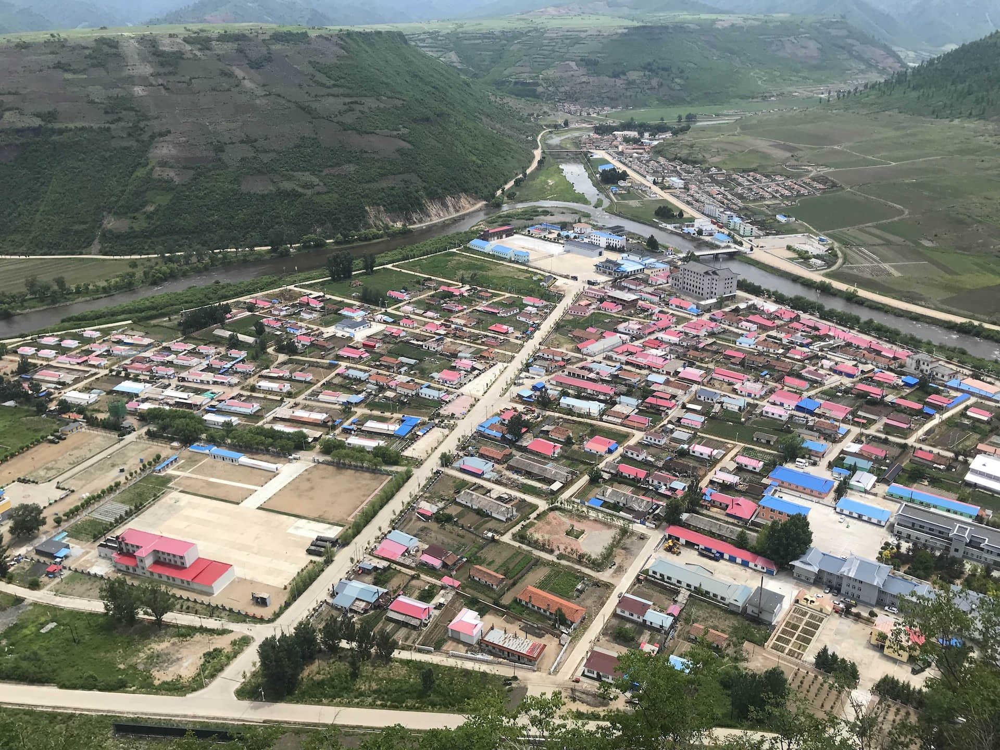

# 2019年度总结

字数:2054 时长:7m10s

转眼间，2019年已经悄悄的走到了的最后一个月，也是10年代的最后一个月，下个月开始我们就要开始本世纪第三个十年了。曾经天真的觉得2012都对于我们来说都是很遥远的数字，不曾想再过一个月就要告别这些过去的时间了。总是觉得逝去的东西才是最为宝贵，因为它们是不可逆的，比如匆匆走过的人群，比如仅此一次的生命。  
我们告别了2019，也将迎来2020。  
今年想在延续去年总结的基础上做一些不一样的尝试，或许可以通过时间线的方式去记录我这一年发生的事情，记录下最想记录下的一些事情。  

**1月20日**:公司年会作为组里的新人表演节目

**2月7日**:这个年有一点特殊,第一次和老婆一家在北京过的年,之后回到了老家.已经有好几年没有回到老家过年,今年和家人一起在东北过的年.

**3月5日**:回到了离开了半年的团队,报到第一天过了我的27岁生日,今年和团队做了好多商业化相关的项目.

**3月7日**:跟之前团队的同事一起聚餐,回忆这段一起并肩作战的日子,虽然时间不长,但感恩相遇.

**4月21日**:在教会一起纪念复活节,第一次尝试表演了圣剧,感谢圣灵同在,节目很成功.

**5月2日**:好哥们来北京休假,几天时间逛完了可以打卡的全部景点,单日最高纪录是在外23小时疯玩…

**5月11日**:来上海参加公益活动,实地测试为活动设计开发的地图,认识了mapbox的同事,很有趣的一天.

**5月12日**:正好还在上海的时候是母校15级后辈们的毕业设计展,毕业后来参加毕设展,后来证明如果这次没来真的就会是特别遗憾的事情,好多教授今年结束后将不再执教,有的教授选择回到加拿大继续做艺术,有的教授和家人到越南做医疗奉献,有的教授则是回归家庭生活,希望以后还会有机会再见到他们.

**5月13日**:来参观朋友公司代理的捷克家具ton的展厅,感叹手工家具的细腻和温度.后面衣架上挂着的那把是当年爱因斯坦特别喜欢的一款椅子.

**5月23日**:岳母的生日赶上老婆公司一年一度的团建假期,就顺便跟公司请了三天假一起来成都重庆游玩,重庆成都两个城市离得很近,但各有各的特色,很充实的一段假期,拍了很多照片,留下很多回忆.照片中努力为了显腿长凹造型的老婆大人.

**6月22日**:准备拍摄婚纱照和老婆一起来挑选婚纱,准新娘为了选到漂亮的婚纱前前后后选了三四次,最终拍摄效果来看一切都是值得的,穿上婚纱的样子真的特别美!

**6月24日**:老婆第一次也是最后一次给朋友当伴娘,算是了了一个心愿.也是我们完成婚礼前参加的最后的一个婚礼,我们全程都是在仔细观察这对新人的婚礼流程,希望在我们的婚礼时能够做到尽可能的完美.

**6月26日**:开车带着爸妈还有老婆一起回了曾经生活的那个小村子,和老婆在一起九年了也是第一次来到这里,依然是山清水秀的那个边境小镇,希望以后能在留着的那块宅基地上给家人盖一栋小房子.照片中三角形区域以外的部分就是朝鲜了.

**7月2日**:从早到晚忙了一整天,终于拍完了婚纱照,照片中的这对新人很快就要成为夫妻了.婚纱照拍的很满意~哈哈..

**7月25日**:准备了大半年,终于要踏上去柬埔寨这块宣教地了.希望上帝祝福这里的人们.这趟行程留下了很多的故事,也在博客里认真的做了记录.

**10月5日**:这一天我们结婚了,这辈子最值得回忆的一天,但是当天真的特别紧张,婚礼讲话时差点没激动的哭出来,到现在还感觉在做梦,在一起九年,我们终于结为夫妻,到现场的有我们的家人、同学、老师、还有最好的朋友们,好多好多很久没有见到的人.我们会一直幸福.

**10月24日**:1024程序员节我司优秀的开发们,就在这个月商业化的项目完成了年初定下的小目标,其实到了年底已经超额30%完成,新的一年希望能更加出色.

今年的总结以时间轴的方式做了记录,发生的事情很多,真的是非常充实的一年,也是充满变化的一年.包括工作还有生活的方方面面.

首先最大的收获也是最幸福的一件事情就是和亲爱的经历了多年的恋爱长跑，终于步入了婚姻的殿堂。希望往后的每一天都是和她度过的最美好的一天，一屋二人三餐四季。

我觉得我这辈子做的最酷的一件事情就是在18岁那年看到了喜欢的她，然后有勇气说出了爱，并一路走到现在.依然感谢上帝为我们的预备.

工作中在团队一直思考有没有为团队带来价值,简单来讲公司就是我的客户，我要用有效的工作和产出来支持公司的业务。一方面是对公司，另一方面则是对我个人,更多的是要看自己有没有进步，这个月是不是比上个月收获更多一些。

## 年度推荐
* 书：交互设计沉思录、 디자이너의 생각법;시프트
* 软件：figma
* 硬件：iPad pro + apple pencil
* 景点：洪崖洞、吴哥窟
* 电视剧：庆余年

## 2019年目标复盘
* ~~完成婚礼 和爱人进入下一个人生阶段~~完成
* ~~学点开发 能自己设计并开发网站~~ 完成
* ~~一次境外、一次境内的旅行~~完成
* ~~多看一些展,参加一些活动~~基本完成 展览还是参加的比较少

## 2020年目标
* 基于去年的财务计划达标,今年决定特批一笔家庭理财本金去尝试投资和理财,目标不是定很高的回报率,而是找到适合自己的投资理财计划.
* 给家人全员参保,为生活多一分保障.
* 希望成立一家工作室,积累一些跨领域的作品.
* 想要了解设计专利和产权保护一些知识,希望能有自己的专利号.
* 一次国外和国内的旅行,多去看看没见到过的世界,认识一些有趣的人.

最后放上2019年的每天一秒钟视频作为结尾
[微博链接](https://www.weibo.com/5053554055/InkTHp7Gf)

明年再见~