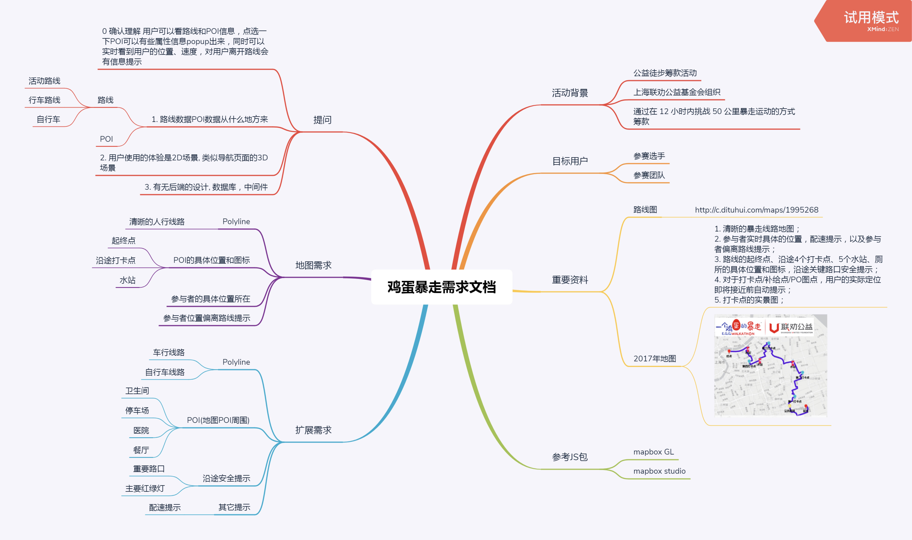
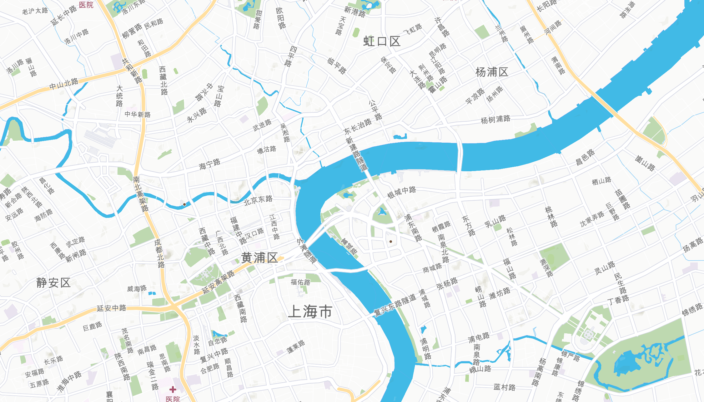
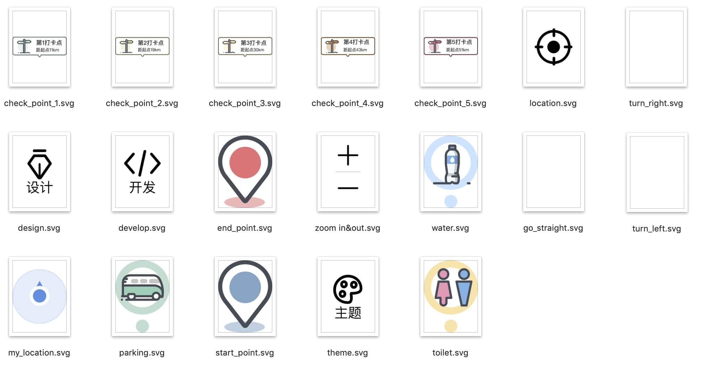
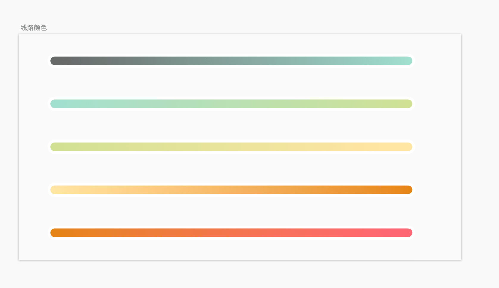
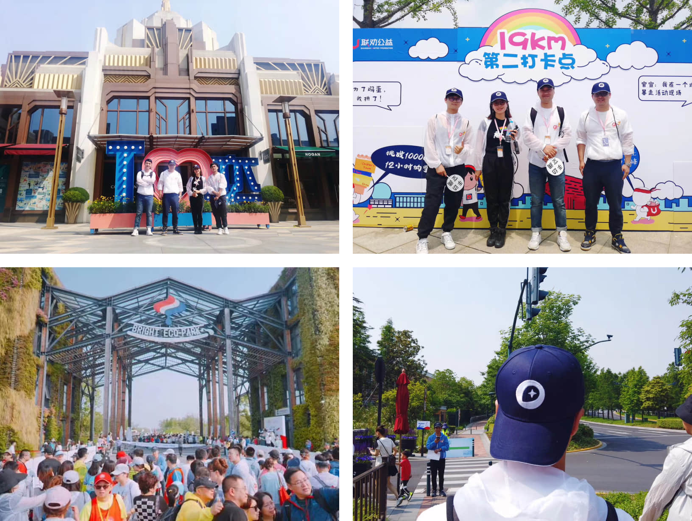

# 公益活动【一个鸡蛋的暴走】地图设计

## 什么是鸡蛋暴走活动？
鸡蛋暴走是上海联劝公益基金会主办的一场公益活动,旨在帮助0到18岁弱势儿童平等健康成长,参与活动的选手需要在12小时内走完50公里的既定路线,今年的路线是从上海的迪士尼公园旁边的申迪生态园出发,经过四个打卡点最终走到浦东的外滩.    
首先知道鸡蛋暴走这项活动还是在mapbox的公众号文章，文章当时是招募设计和开发的志愿者，有意向报名最终成功入选的话可以去到上海,和mapbox的团队一起参与当天的暴走活动。

## 我们能为活动做些什么？
活动需要招募一个团队来和mapbox一起为活动主办方设计开发一款地图，地图是基于网页端的实现，作为设计师我需要参与项目的前期概念设计，实现的功能点、还有具体的交互设计以及界面的UI。前期讨论的需要包含的功能点主要有标记活动路线，饮水点、打卡点还有卫生间等位置标记，距离下一打卡点的距离、以及更多小的功能点。最终实现的功能点可能不会这么完善，会根据优先级去安排工作量，再去取舍一些小的设计。  
总体的需求如下图所示：

## 整个地图的设计思路是怎么样的？
最终组队的时候我和我的开发小伙伴程诚一起完成这项工作，程诚作为工程师会去具体实现功能点的开发工作,我作为设计师去提供任务所需的所有设计支持部分.
### 概念
前期的设计思路是花费最多时间的部分,前后大概有一个月的时间一直在探讨方案的探索和可行性,一直在调研和学习.其中有一个方案是受启发于游戏的关卡的概念,让参与到活动的志愿者能在徒步过程中像是游戏闯关一样激发心流,更加投入和激励用户完成全部的关卡.这其中每个关卡的完成和下一关卡的过渡就比较的关键,因为全部四个大卡点,所以我们希望每个关卡结束后新的路线展现不同的概念的地图,构思过包括一年四季的更迭这种变化等多种方案.
### 开发
因为这次的开发是基于网页去实现,所以涉及到很多的包括适配等问题,其中因为需要在网页做动画等转场特效还调研了几个有意思的方案
* [Lottie](https://lottiefiles.com/?page=1)  
Lottie是airbnb推出的一个动画实现方案,可以很方便的支持并应用于web、ios和安卓等系统上,也有在线预览动画效果的网页,只需要在ae里面制作好动画并渲染生成一份json文件,并将json文件给到开发同学,就能将动画在网页上渲染出来.他自身也有一个比较完整的开源动画库可以自己去下载json文件甚至ae工程文件.但它也不是支持所有类型的动画,可以查看他支持的ae属性.
* [ae2css](https://github.com/bigxixi/ae2css)  
这套方案是网易云音乐的团队在实际项目中使用过的一套方案,主要原理是将ae制作的动画导出css代码,在ae里面设计好内容后只需要执行ae2css脚本就能生成一份css文件,如果有需要也可以生成标记好的精灵图出来.
### 定稿
最终的设计和我们最初的预想有点出入,我们在前期方案上的很多内容都被砍掉了,砍掉了很多分支,只留下了主干内容.我们为不同主题设计的地图最终主办方看中了其中一套主题,这套主题也是我在稀客前期设计地图样式的时候一直优化并使用的样式.方案并没有转场的需求所以前面的提到的几个技术方案也没有用上,有点可惜,但好在也试验并了解了一些好玩的内容.  
#### [设计输出内容-figma文件](https://www.figma.com/file/ew3L0HNNOGtLR9mXDSccFC/EggWalkathon-style-1)<iframe style="border: none;" width="800" height="450" src="https://www.figma.com/embed?embed_host=share&url=https%3A%2F%2Fwww.figma.com%2Ffile%2Few3L0HNNOGtLR9mXDSccFC%2FEggWalkathon-style-1%3Fnode-id%3D0%253A1" allowfullscreen></iframe>  

* [底图](https://api.mapbox.com/styles/v1/youngbeom/cjtjoc0n41pxj1fqr8cq0l7od.html?fresh=true&title=true&access_token=pk.eyJ1IjoieW91bmdiZW9tIiwiYSI6ImNpc2ZxMXpvbTAxb2wzbm52cWI3d21xd3kifQ.-8V1Aipme2wTcp_9R95p7w#11.1/31.1903/121.5621)

这里要感谢[稀客地图](http://app.ckditu.com)提供的底图支持,专注做旅行场景的地图应用,推荐.

* [图标](https://www.iconfont.cn/collections/detail?cid=18856)

图标的设计和颜色样式上体现活泼的整体调性,icon用了filled-outline的风格,加粗描边和颜色填充使得图标更加的卡通立体.图标是直接上传到iconfont供工程师调用.

* [线路](https://docs.mapbox.com/mapbox-gl-js/example/line-gradient/)

设计中颜色是可以传递信息的,在这次的线路设计中也是埋下了一些“小彩蛋”.线路整体上采用白色描边加上颜色填充的设计,使得线路在底图上能更加的凸显出来,不同路段使用不同的颜色基调,整体的设计是从无彩色到有彩色,从冷色过渡到暖色的应用.寓意是希望志愿者通过这场公益活动,能让受到关爱的儿童更加感受到社会的温暖,志愿者每完成一道关卡就会使线路的颜色更加的温暖,希望参与这次活动的志愿者感受到这种从“冰冷”的到“炽热”的转变.

## 写在最后
觉得活动还是非常有意义的,在整个设计的过程中觉得还是有很多的细节没有好好打磨,是一个比较可惜的地方,感谢提供支持的mapbox团队,感谢超级细致认真的开发小伙伴程诚.在活动当天跟着mapbox团队一起组队参加了活动,感受到了大家对公益活动的热情,今年的活动共有702支队伍参与,筹款总额超过了1200万元.  
路上还看到了有一位大叔身体不是很好,但是还是推着轮椅完成了整个赛程,为他的坚持感动.    
如果有机会还想参加明年的活动.

相关文章:  
[邀请你来做1个月的公益地图设计志愿者，见证策划到落地，来不来？](https://mp.weixin.qq.com/s/4BJs9jqF52FL3aOZNuAVyA)  
[2 个 95 后开发者，独家揭秘「一个鸡蛋的暴走」地图设计思路](https://mp.weixin.qq.com/s/t6ja1RxFiEiHfakxV_EuOQ)  
 [A fresh map for the annual Shanghai E.G.G. Walkathon](https://blog.mapbox.com/a-fresh-map-for-the-annual-shanghai-e-g-g-walkathon-f19be28023d4) （需要梯子）
