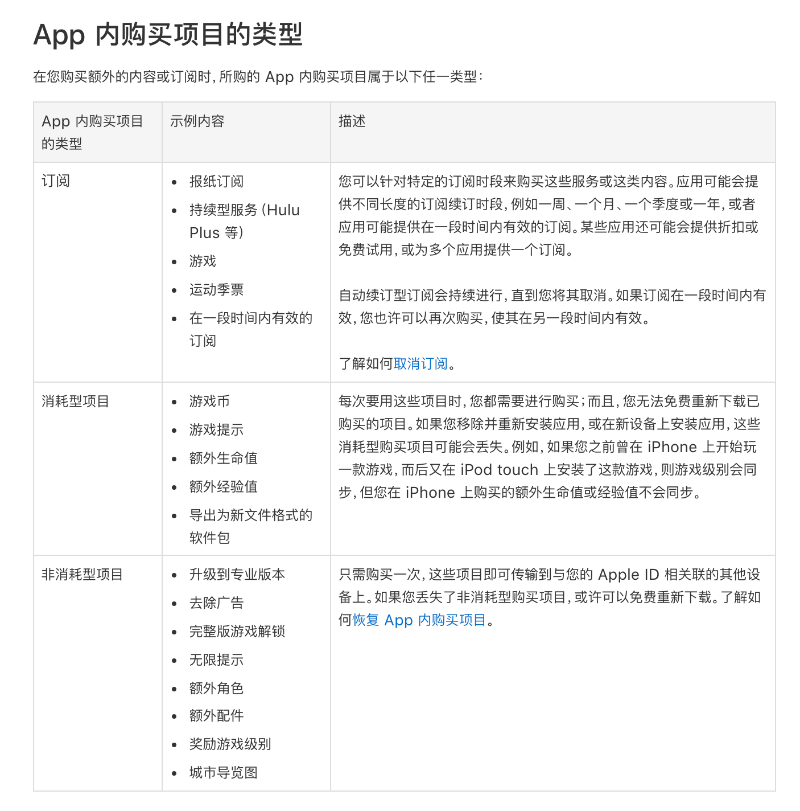

# 来谈谈iOS内购以及如何合理“避税”
## 什么是iOS内购(IAP)  
IAP 全称：In-App Purchase，是指苹果 App Store 的应用内购买，是苹果为 App 内购买虚拟商品或服务提供的一套交易系统  

## IAP的适用范围  
在App内需要付费使用的虚拟商品/服务，比如游戏道具、电子书、音乐、视频、订阅会员、App的一些高级功能需要使用IAP，如果是用户在iOS应用内购买的是实体商品则是不适用于IAP的，比如用户在淘宝买的购买的鞋子等实体商品，又或者用户完成购买后不在App内使用的虚拟商品（如话费充值）或服务（滴滴打车、Uber、Lyft）则不适用于IAP。  

如果需要在应用内界定并使用IAP的话，苹果会收取30%的交易额作为平台抽成，如果开发者或者公司又需要缴纳一定的税的话实际到手的的收入会少于70%，对于内容创作者或者是分销商等利润比较少的公司则是非常大的门槛和打击。  

这30%的抽成就是大家常说的苹果税。因为苹果的内购在国内具体使用时会存在使用时比较慢，操作复杂等问题，所以在实际用苹果内购支付的话在支付转化率上，会产生一些比如转化率折损的情况。所以在实际体验时比如订餐时都会弹出选项让用户去选择微信或者支付宝。  

## App内购买项目的类型  
  
图片来源：[通过 App 内购买和订阅购买额外的应用功能 - Apple 支持](https://support.apple.com/zh-cn/HT202023)  

## “避税”条件  
1. 虚拟商品的交易行为没有直接发生在应用内  
2. 应用不能提供直接跳转至其他第三方交易的操作行为  
3. 不在app内使用的虚拟商品不适用于IAP（in app pay），比如充话费和打车（滴滴、Uber、Lyft）  

苹果的这一项政策实际上是针对在应用商店上架的应用中的虚拟商品部分，关于这项政策反映最为强烈的应该就是典型的虚拟付费内容提供商，比如国外的 netflix（对标国内的爱奇艺），他所提供的服务就是一项用户需要付费购买的线上虚拟服务，比如他的会员订阅。netflix应用是2018年全球最赚钱的iOS应用，收入高达7.9亿美元，国内的腾讯视频和爱奇艺以及快手也跻身前五。  

一些反对苹果税的公司还起诉了苹果公司，但是法院却没有以违反垄断法的内容为名对苹果作出不利的裁决，因为法院认为开发商理论上可以不在苹果的应用商店上架应用，而去选择其他渠道。实际上netflix也是这么做的，其在iOS应用上并没有付费选项，用户订阅会员可以登录其网站进行操作，避免在苹果平台上产生交易。  

这里面其实应用商会造成很多的折损，因为上面提到的第二条就要求应用不能提供直接跳转，甚至引导用户在第三方平台完成付款的提示都会在审核时遇到上架风险。  

## 偷换概念去“合理”避税  
国内很多应用尝试将虚拟商品结合实体商品的特性进行避税，举个例子：知识付费领域里的一些产品虽然服务大部分是可以通过线上完成，但还是在用户付款时要求输入地址并寄去纸质参考材料，这样就可以说明交易的主体是实体商品，并非虚拟商品。  

另外在[App Store Review Guidelines 3.1.4](https://developer.apple.com/cn/app-store/review/guidelines/#hardware-specific-content) 里面还有这样一条特殊规则：**3.1.4 硬件相关内容：**在为数不多的情形中，例如当功能依赖于特定的硬件功能时，app 可在不使用 App 内购买项目的情况下解锁相应功能 (例如，天文 app 会在与望远镜同步后增加功能)。与经过批准的实际产品 (如玩具) 配合使用的可选app 功能可在不使用 App 内购买项目的情况下解锁特定功能，前提是它同时也提供 App 内购买项目选项。您不得要求用户通过购买无关产品或参与广告或市场活动来解锁 app 功能。  

比如运动类的App在提供一些计步器的功能时设置为收费项目，但同时用户在完成购买后会收到一个实体的手环，但这种情况苹果也不会完全将这种情况排除在IAP以外，理由很简单，这项计步器的功能是否可以完全脱离实体手环？如果可以那还是归到IAP范围，必须保留应用内购买的选项，用户可以通过其他途径先买到手环再去解锁收费功能这是允许的。  

通过仔细阅读苹果应用内购买的一些条款是比较难做出一些规避的，除非售卖的虚拟商品消费场景不在应用内，或者是不算虚拟商品。所以我们提到的“合理”避税是一个伪命题，你能避开苹果税说明你就是合法的，除非你花大量的市场投放教育用户像Netflix一样只能通过网页去充值订阅。  

也有的应用会采用例如：  
1. 通过后台开关控制在某些时间开启第三方支付，  
2. 根据用户信息识别出明显不是苹果审核人员的用户开放第三方支付  
3. 引导用户跳转到小程序结算支付（小程序也有规则需要避坑）[iOS虚拟支付 | 微信开放社区](https://developers.weixin.qq.com/community/operate/detail/1006)  

其实一开始最重要的是一个定性的问题，我在苹果应用内售卖的商品是否属于虚拟商品，是否必须使用IAP。对于很多独立开发者而言，苹果的IAP其实也是一种技术服务的支持，我所了解的很多独立开发者其实也还是很好的利用苹果提供的这样的服务，像上架一些商品一样去定价、结算。  

## 苹果为什么要设置苹果税？  
其实设置一些门槛是一种非常好的规范商业秩序的手段，苹果选择了抽成这种看似对开发者门槛很高的手段。如果一个开发商在应用内设置虚拟商品且价格不受平台约束那么是一件非常可怕的事情，比如开发商可以通过自己的定价去影响虚拟商品的成交，也会有很多刷单的可能。甚至平台可以自己定价低价买进高价卖出，这种手段在某些不法区块链行业也不是没有出现，被割的都是一些不明真相的韭菜。

## 苹果税对我们用户有什么影响？  
我不是一个独立开发者，没有产品给苹果缴税，但是作为一个用户在正常使用一些应用的时候还是会有一些影响。  

首先我自己本身并没有太过频繁购买虚拟商品的习惯，像是知识付费或者是直播打赏等等。但是工作中难免会有一些工具是需要去付费的，比如设计工具figma，还有阿里云的一堆付费服务(最后发现出了域名以外，其他好多东西都是冗余了，并没有产生多大价值)。在iOS平台上去年订阅了一年的[bear](https://bear.app/cn/)，这篇文章就是通过bear去写的，体验很好，值得推荐。

还有就是订阅了好几年的爱奇艺会员，但是爱奇艺会员在订阅的时候有一个秘密可能有一些人不是很了解，就是各平台上爱奇艺的会员价格是不同的，

以爱奇艺为例对比安卓和iOS的价格：  
  

腾讯视频会员对比安卓和iOS的价格：   
  

优酷会员对比安卓和iOS的价格：  
  

其实虚拟商品付费的一些项目或多或少都会出现价格不统一的情况，这就是因为苹果税导致的问题。很多公司也把这项政策带来的收益减少带来的问题转嫁给了用户。虽然苹果本身对于不同渠道购买会员的跨平台同步也有一些限制和说明，但是实际测试和使用来看爱奇艺是可以选择不在苹果设备上充值，但是还能在苹果设备上使用会员服务的，因为现在用的爱奇艺会员就是在网络电视终端上完成购买的。  

现在对于苹果税的问题大家呼声都很大，不光是开发者正常用户也要为苹果的政策进行付费，也有人说这是抢劫，利用市场上的支配地位进行垄断，但实际情况是反垄断法规定的断定经营者有市场支配地位的条件是：  
1. 一个经营者在相关市场的市场份额达到二分之一的；  
2. 两个经营者在相关市场的市场份额达到三分之二的；  
3. 三个经营者在相关市场的市场份额达到四分之三的；  

苹果目前的市场份额还远没有达到以上的情况，所以消费者如果不认同或不支持这种条款，可以选择使用别的公司的产品或者服务。  

参考链接：[iOS 内购（In-App Purchase）总结 | 笑忘书店](https://xiaovv.me/2018/05/03/My-iOS-In-App-Purchase-Summarize/)  
建议阅读：[聊聊应用内购买-黄文臣](https://blog.csdn.net/hello_hwc/article/details/89441828)  

  
官方资料:
* [In-App Purchase - Apple Developer](https://developer.apple.com/in-app-purchase/)  
* [Best Practices and What’s New with In-App Purchases - WWDC 2018 - Videos - Apple Developer](https://developer.apple.com/videos/play/wwdc2018/704/)  
*  [App内项目购买配置流程](https://help.apple.com/app-store-connect/#/devb57be10e7)   
