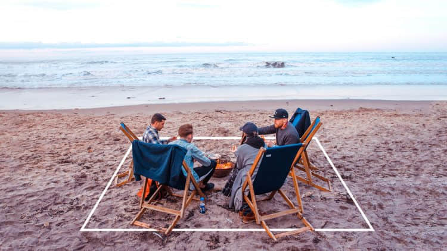
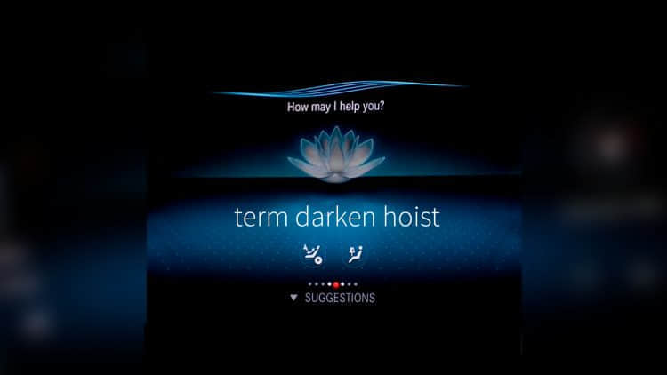
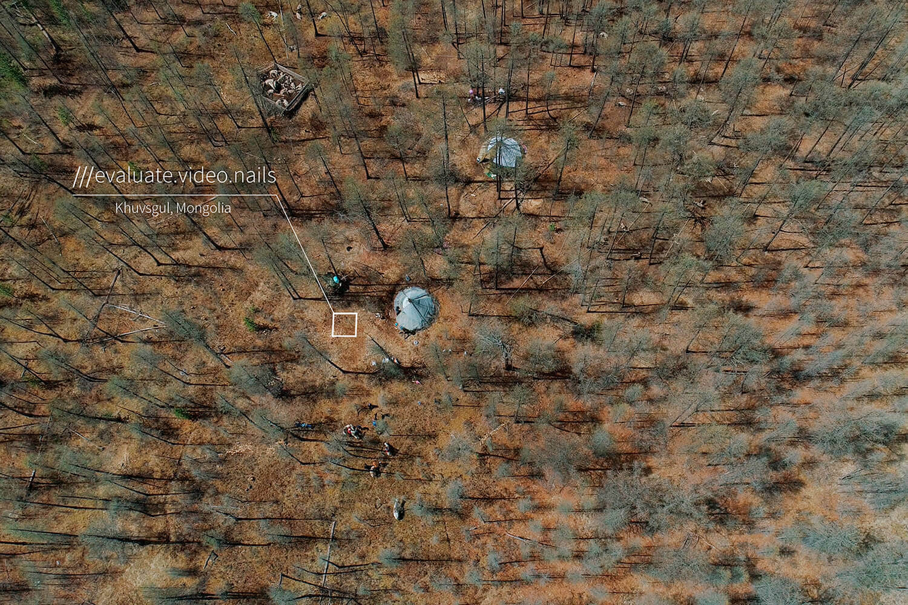
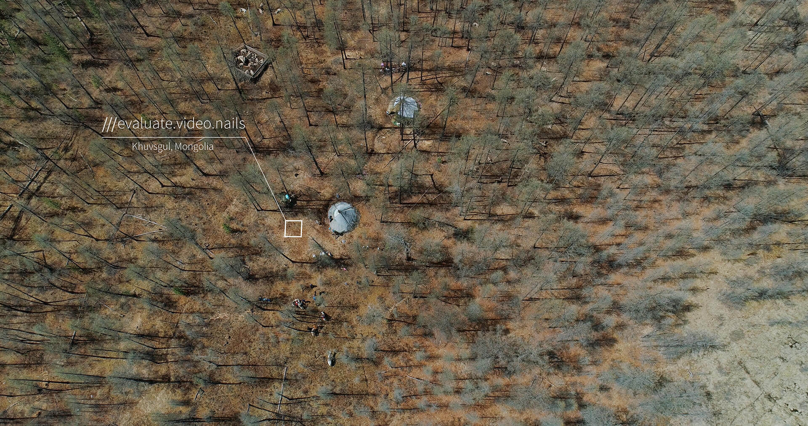
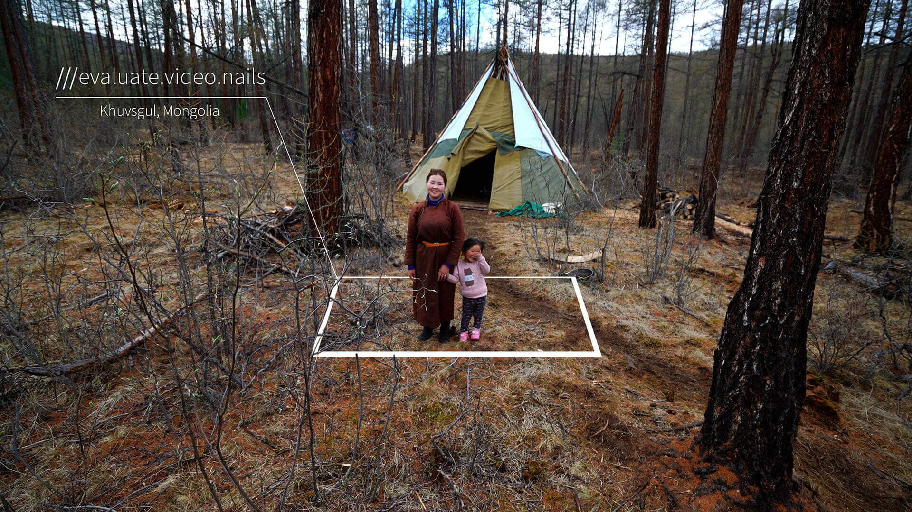
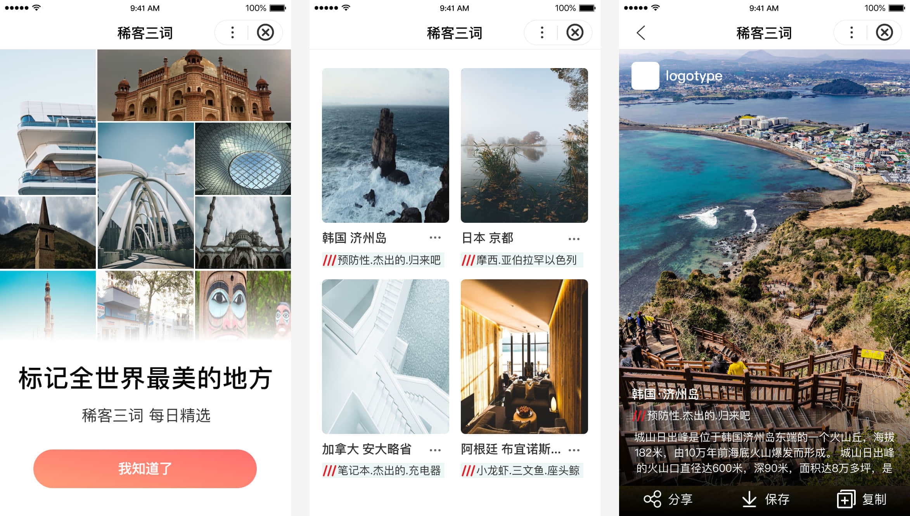
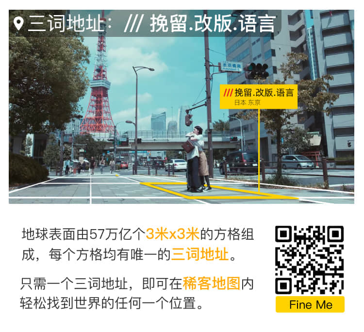
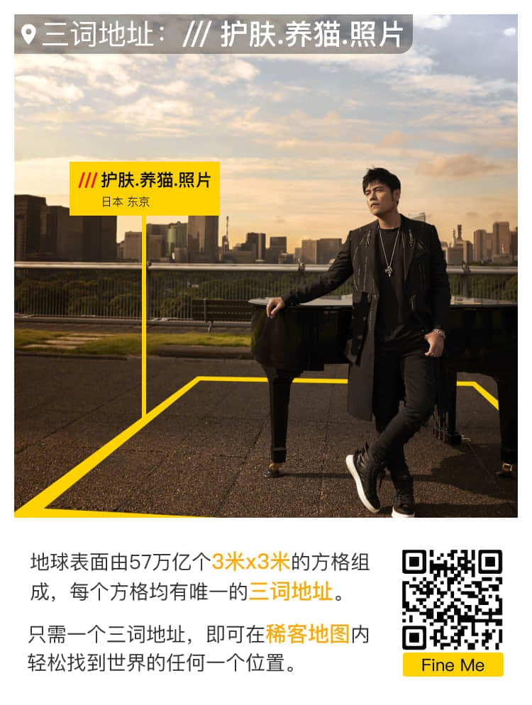

# 用三词地址分享这个美好的世界
文字:1732    阅读时长:5m32s

<iframe style="border: none;" src="https://hk-static.ckditu.cn/wxapp/video/w3w_travel.mp4" width="100%" height="450" allowfullscreen="allowfullscreen">
</iframe>

 

## 什么是三词地址 
想了解三词地址首先我们要了解一下我们常用的地理坐标系统-[经纬度](https://baike.baidu.com/item/%E7%BB%8F%E7%BA%AC%E5%BA%A6)   

经纬度是经度与纬度的合称组成一个 [坐标系统](https://baike.baidu.com/item/%E5%9D%90%E6%A0%87%E7%B3%BB%E7%BB%9F/4725756) ，称为地理坐标系统，它是一种 [利用](https://baike.baidu.com/item/%E5%88%A9%E7%94%A8/882910) 三度空间的 [球面](https://baike.baidu.com/item/%E7%90%83%E9%9D%A2/5889102) 来定义地球上的空间的球面坐标系统，能够标示地球上的任何一个 [位置](https://baike.baidu.com/item/%E4%BD%8D%E7%BD%AE/36166) 。 —百度百科

我们可以将经纬度看成是多个相互垂直的“面”将地球进行切割,是人类为了度量方便而假设出来的辅助线,每一条纬线都是圆形且两两平行.经线是连接南北两极的的半圆弧,每条半圆弧长度都相等,最终相交于南北两极点.  

虽然这套地理信息系统是应用最为广泛的,但是在实际生活中我们还是不会用它来作为地址使用,我们不会给别人一串**39.9087126,116.3975789**这样的数字,而是直接告诉他位置是**天安门**. 

如果是网购寄快递我们也不能直接告诉人们一个天安门就可以,我们会写上XX路XX街XX大厦XX栋XX楼,在这里每个地区和城市对于街道地址的命名还有一些规范和要求,这里是网上找到的一篇关于[济南市市区道路命名规则](https://baike.baidu.com/item/%E6%B5%8E%E5%8D%97%E5%B8%82%E5%B8%82%E5%8C%BA%E9%81%93%E8%B7%AF%E5%91%BD%E5%90%8D%E8%A7%84%E5%88%99).城市内的街道地址是相对完善和便利的,如果是野外的话就会非常依赖经纬度和海拔高度这样的信息.但是经纬度的使用还有一些相对不足的地方,它虽然精确但是比较繁琐,如果是以**39.9087126,116.3975789**为例,纬度小数点后的9误写成了8,那么位置就会定到南四环外,距离13公里驾车30分钟的丰台区南苑.  

三词地址就让我们对地理位置的描述变得更加简单,这套系统为世界上每一块3米的方格都分配了一个独一无二的三词地址,并且他们永远不会改变.  

例如，“///产权.绝缘.墨镜”标注的正是三词地址公司伦敦办公室的正门口。
三词地址易于交流和分享，并且和GPS坐标一样精确。
51.520847,  -0.19552100 ←→  ///产权.绝缘.墨镜

这套系统现已支持超过35种语言,目标是成为全球沟通位置信息的标准。人们可以使用三词地址在音乐节的场地内找到自己的帐篷、导航到民宿并且能够指引紧急服务到达正确的地方。

三词地址现已应用在非常多的场景中,也可以通过[**视频**](https://player.youku.com/embed/XNDMwNDMwMDkzNg==?autoplay=true)来了解其更多的应用.

安排与朋友和家人的聚会。  

在联系信息中添加三词地址，帮助人们找到您。  

通过《孤独星球》等旅游指南，精准导航至正确的地方。  

通过梅赛德斯-奔驰和Cabify输入三词地址即可到达准确的目的地。  

联合国和红十字会正在使用三词地址，为需要救助的地方请求或提供紧急援助。 

通过标注准确的位置来吸引更多的游客。

## 三词地址与airbnb

### 想要让下一次的旅行摆脱一切
从蒙古野外的驯鹿放牧者的帐篷到巴塞罗那的顶层公寓,世界上每个airbnb都有一个独特的三词地址,可以让用户更快的找到民宿的所在地.无论是经验丰富的游客还是airbnb的房东,三词地址都将是最便利的选择.  

生活在蒙古北部的泰加雪林当中的杜卡部落驯鹿牧民,他们过着传统的游牧的生活方式,每隔几周就会收拾自己的蒙古包,跟随者驯鹿的移动而穿越森林.

这些牧民很少会认识新的朋友,他们会将自己的蒙古包作为民宿来接待旅行的人,旅行的人也可以跟当地的牧民一起感受不同的游牧生活.但是因为特殊的身份,经常搬迁造成游客想要用固定的街道地址找到他们几乎成了一件不可能的事情,但是现在他们已经通过三词地址在airbnb上更新自己的房屋.

[稀客地图](http://app.ckditu.com/)现在也支持了三词地址,只需要长按地图就能显示所在地址的三词地址,比如我现在所处的位置的三词地址就是:///好静.学分.草坪

airbnb为了让用户有更友好的使用体验选择了三词地址,游客只需三个单词就能找到准确的入口.支持三词地址的软件包括Google maps,Citymapper和Waze.现在世界各地都开始慢慢接受并应用三词地址的方式.  

## 稀客三词与稀客地图
稀客地图是国内比较早接入三词地址的应用之一,通过搜索三词地址能轻松的找到地点并进行路线规划.稀客地图通过整合旅行目的地的海量商品,让游客在地图上不仅能进行位置检索、路线规划还可以直接购买体验商品,让整个旅行的体验和行程更加的便捷和轻松.  

新开发的百度智能小程序是除了稀客地图应用和稀客旅行微信小程序以外的其他尝试,产品通过收集世界上著名的自然观光地或者人文景点的摄影图片展示给用户,按时推送这个世界上发生的有趣的事情,用户通过简介可以了解到摄影作品中正在发生的故事,并且通过复制三词地址来进行位置检索和线路规划.

想起之前在柬埔寨看到那些带着笑脸的孩子,就想着希望能做一个产品将一切美好的影像定格在发生的那个地点,人们可以找到那个3X3米的地方.比如前一阵子周杰伦新出的歌曲 [说好不哭](https://y.qq.com/n/m/detail/mv/index.html?vid=t0032kwa29w)中的东京铁塔和大厦天台:
  

